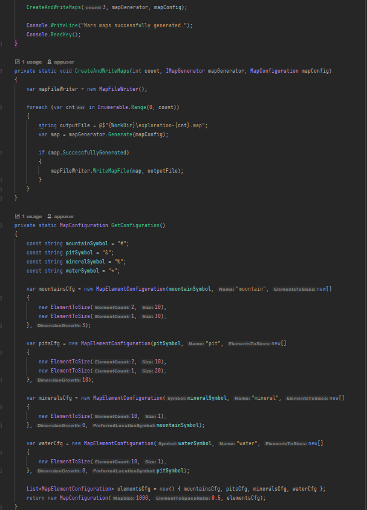
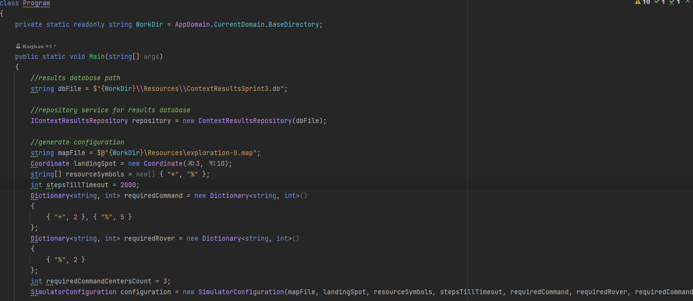
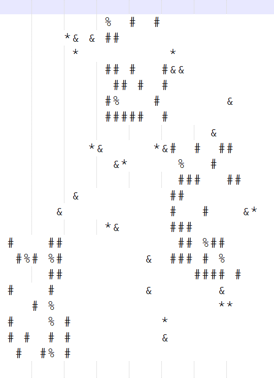
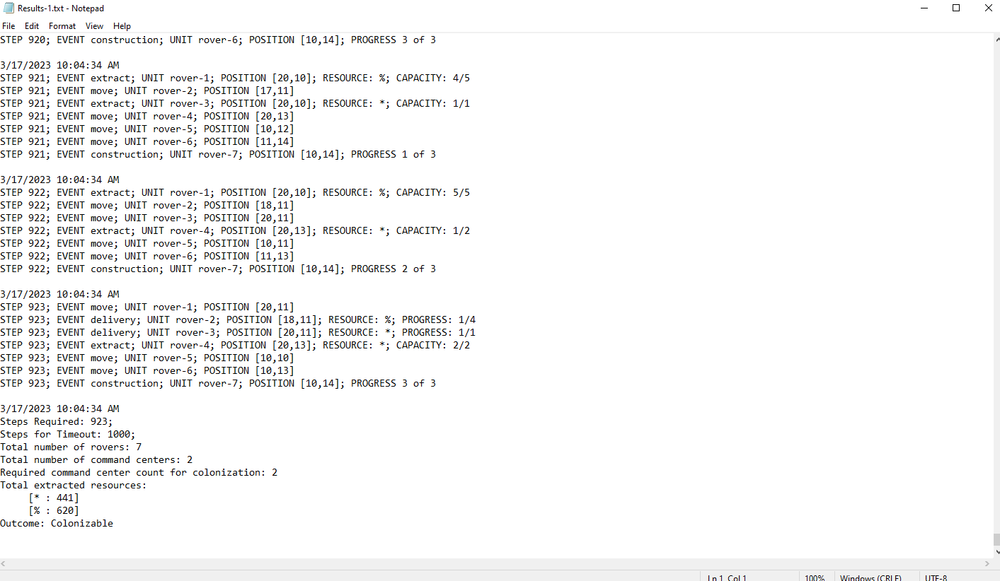
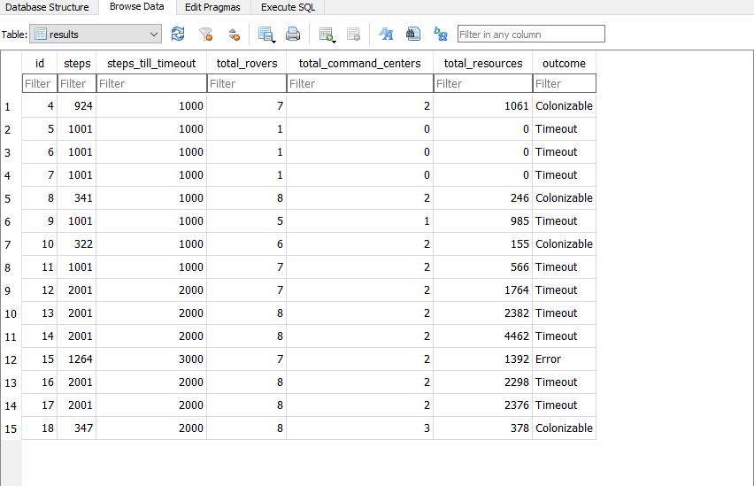
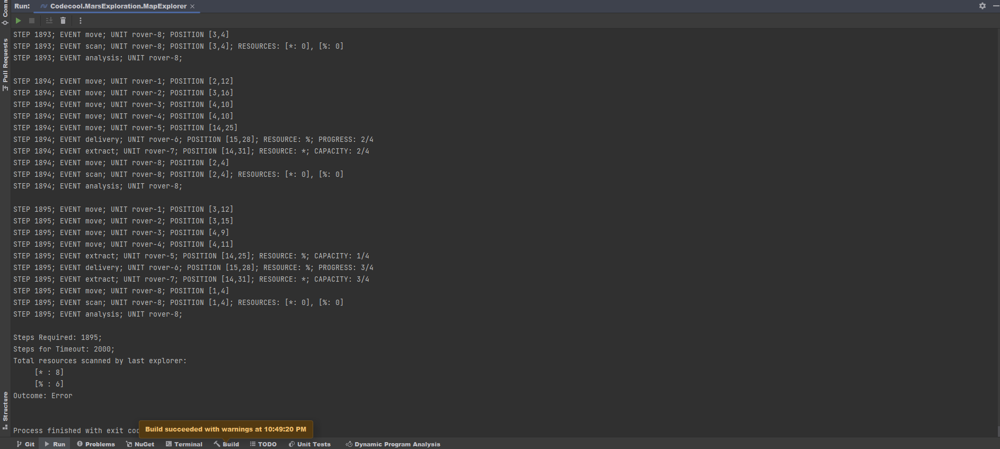

# Mars-Exploration

## Description

Looks like humanity will have a bright future after all: the colonization of Mars has finally started. But it is no small effort. To avoid wasting billions of dollars 
worth of equipment in space, a lot of simulation exercises need to be done – here on Earth.
This is a C# console project finished in 3 sprints (~15days):

### Sprint 1
The purpose of the first sprint is to generate random maps of potential environment from Mars, based on custom configurations.
Example for map element configurations:
- '#' mountains: these are always multi-dimensional, and don't have a location preference (placed randomly), dimension growth: 3
- '&' pits: multi-dimensional objects, random placement, dimension growth: 10
- '%' minerals: single-dimensional object, placed next to mountains, dimension growth: 0
- '\*' pockets of water: single dimensional objects, placed next to pits, dimension growth: 0

### Sprint 2
The purpose of the second sprint is to simulate the maps generated previously and gather information about resources and terrain in order to determine if the planet is 
colonizable, in a finite amount of steps. This is done based on a custom set of analysis steps done by the exploration rover.
Example:
- A Timeout analysis checks whether the current step number reached the timeout amount
- A Success analysis checks whether the right conditions for colonization are met
- A LackOfResources analysis checks whether the rover almost explored the whole chart and no right condition is found

### Sprint 3
The purpose of the third sprint is to go beyond exploration and prepare the ground for colonization by constructing command centers and rovers for different tasks.
- Extend previous rover routines by adding extraction, delivery and construction options
- Command center structure that is able to construct more rovers for exploration, or resource extraction
- Colonizable now has a different meaning: being able to construct a desired amount of command centers and extract resources

## Tools and technologies learned

- done in a C# console application
- maps stored in .txt files
- data results stored in a local SQLite database
- learning and use of design patterns (Observer arhitecture, Repository pattern, etc.)
- learned SOLID principles

## Starting Commands

### MapGenerator Configuration
There is no specific UI for configuring the map generator project parameters. You have to manually change them from code



### MapExploration Configuration
There is no specific UI for configuring the map exploration project parameters. You have to manually change them from code



### Build and Run
Build and run the project from your favourite IDE. This project was done in .NET Core 7 so make sure you at least have this version.

### Accessing data
You can specify the output directiories for generated map, logs, exploration results and db as stated above. The default directories are relative to the project and created in .bin after run.

Logged results in .txt files:
```bash
cd Codecool.MarsExploration.MapExplorer\bin\Debug\net6.0\LoggedResults
ls
```
Resource maps and db file:
```bash
cd Codecool.MarsExploration.MapExplorer\bin\Debug\net6.0\Resources
ls
```

## Visuals

### Generated Map

### Logged results in .txt file

### Results in database

### Logged results in console:


## License
This project is licensed under the MIT License. See the LICENSE file for details.

## Contact
Feel free to contact me at: karjhan1999@gmail.com